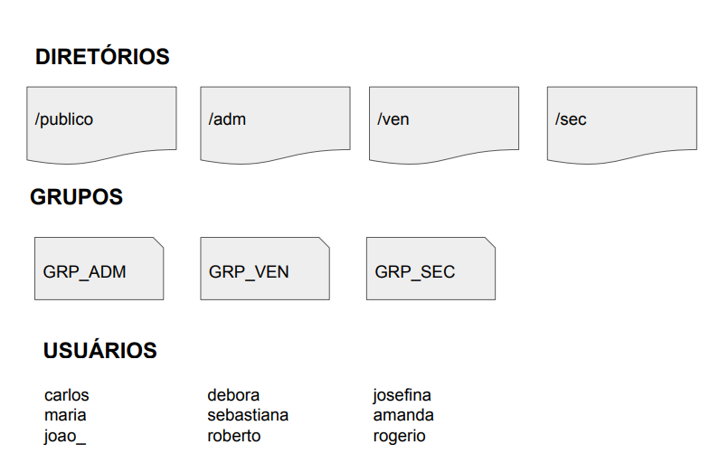

# DIO-DevOps
# Infraestrutura como código: Script de criação de estrutura de usuários, diretórios e permissões 
## Objetivo da atividade
Automatizar o provisionamento da infraestrutura com a IaC (Infraestrutura como código) para o gerenciamento de usuários em ambientes Linux.

### Definições da atividade
-  Excluir diretórios, arquivos, grupos e usuários criados anteriormente;
- Todo provisionamento deve ser feito em um arquivo do tipo Bash 
Script;
- O dono de todos os diretórios criados será o usuário root;
- Todos os usuários terão permissão total dentro do diretório publico;
- Os usuários de cada grupo terão permissão total dentro de seu respectivo diretório;
- Os usuários não poderão ter permissão de leitura, escrita e execução  em diretórios de departamentos que eles não pertencem;
- Subir arquivo de script criado para a sua conta no GitHub.

#### A atividade será desenvolvida seguindo o seguinte esquema:

<center>



</center>

### Desenvolvimento 
Para a resolução da atividade foi criado o seguinte script: 

```
#!/bin/bash

echo "Excluir diretórios, arquivos, grupos e usuários criados anteriormente"
rm -r -f publico vem ven sec 
userdel GRP_ADM
userdel GRP_VEN
userdel GRP_SEC

echo "Criando os diretórios"
mkdir -v publico adm ven sec

echo "Criando os grupos de trabalho"
groupadd GRP_ADM
groupadd GRP_VEN
groupadd GRP_SEC

echo "Criando os usuários e adicionando aos respectivos grupos"
useradd carlos -m -c "Carlos | GRP_ADM" -s /bin/bash -p $(openssl passwd senha123) -G GRP_ADM
passwd -e
useradd maria -m -c "Maria | GRP_ADM" -s /bin/bash -p $(openssl passwd senha123) -G GRP_ADM
passwd -e
useradd joao -m -c "João | GRP_ADM" -s /bin/bash -p $(openssl passwd senha123) -G GRP_ADM
passwd -e

useradd debora -m -c "Debora | GRP_VEN" -s /bin/bash -p $(openssl passwd senha123) -G GRP_VEN
passwd -e
useradd sebastiana -m -c "Sebastiana | GRP_VEN" -s /bin/bash -p $(openssl passwd senha123) -G GRP_VEN
passwd -e
useradd roberto -m -c "Roberto | GRP_VEN" -s /bin/bash -p $(openssl passwd senha123) -G GRP_VEN
passwd -e

useradd josefina -m -c "Josefina | GRP_SEC" -s /bin/bash -p $(openssl passwd senha123) -G GRP_SEC
passwd -e
useradd amanda -m -c "Amanda | GRP_SEC -s /bin/bash -p $(openssl passwd senha123) -G GRP_SEC
passwd -e
useradd rogerio -m -c "Rogério | GRP_SEC" -s /bin/bash -p $(openssl passwd senha123) -G GRP_SEC
passwd -e

echo "Gerenciando permissões"
chown root:GRP_ADM /adm
chown root:GRP_VEN /ven
chown root:GRP_SEC /sec

chmod 770 /adm
chmod 770 /ven
chmod 770 /sec
chmod 777 /publico

```


 
